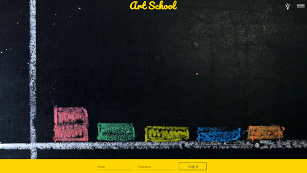
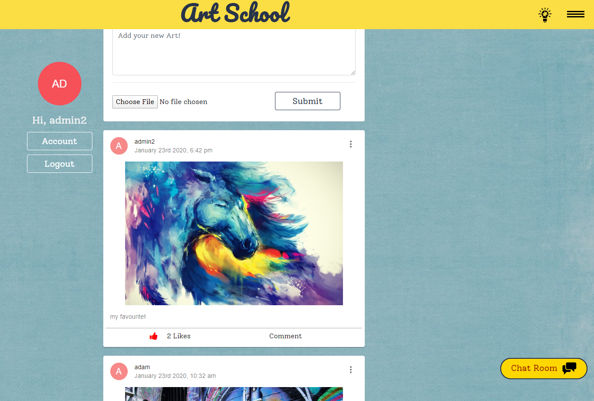
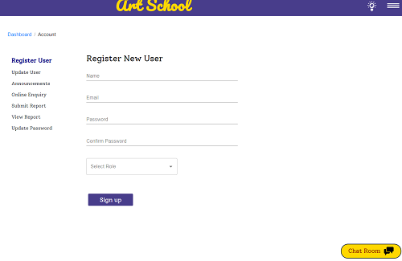

<h1>Art School</h1>

 Welcome to Art School, 

Art School is a website for students, teachers, admins and other staff of an institution. In this website various users have different restricted access. The Website can be modified to suite various other Courses also.

<h3>Getting started</h3>

Make sure you install all the dependencies you need for the project including Node.JS and MongoDB. You Once you have these installed enter the following commands into the terminal.

git clone git@github.com:akhil411/art-school.git

npm install 

npm start

The app will be running on localhost:3000.

<h3>Deployed Heroku Link</h3>

<a href="https://art-school.herokuapp.com/" target="_blank">Art School App</a>

<h3>How it Works</h3>

Login with the credentials.
Please contact for the login credentials.

 </img>

Post any image or thoughts in the post section or can chat with other users online in the chatroom.

</img>

navigate to the account section for account management.
the options changes according to the roles. 

</img>

<strong>What each users can do:</strong>

<li>Admin - add & update users, manage website contents, view & submit student reports
<li>Staff - manage website contents, view & submit student reports
<li>Teachers - view & submit student reports
<li>Students - view report

The main highlight is that every users can post their artwork in the website and others can like and comment on each post. Also, there is a chat application in which users can chat in a common chatroom.

<h3>Technologies/Services Used</h3>
<li>React.js
<li>Node.js
<li>Amazon S3
<li>MongoDB/Mongooose
<li>Express.js
<li>Bootstrap

<h3>Packages/Libraries Used</h3>
<li>Redux
<li>Material-UI
<li>React-Tabs
<li>Socket.io
<li>React-Infinite-Scroll
<li>JSON Web Token
<li>Passport
<li>Validator
<li>Multer
<li>bcrypt

<h3>Key Skills Demonstrated in this Project</h3>
<li>Set Authorization using Redux, JSON Web Token and Passport
<li>Amazon S3 Web Service for image upload
<li>Demonstrated the use of React Context in Information Component
<li>Chat Application using Socket.io
<li>Material-UI used throughout the website
<li>Set up infinite scroll for the posts to increase the page loading speed.

<h3>To Do/ Further Development</h3>
<li>Set announcements notifications
<li>Sending mail to the user after submitting Online Enquiry
<li>Other Inner Pages Development
<li>Further Styling of the Website
